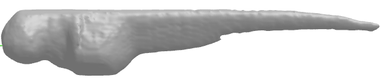
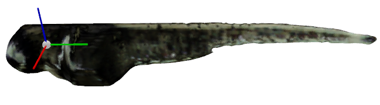

## Camera Calibration Under Circular Motion

This is the python implementation supporting our paper ["Probabilistic Inference for Camera Calibration in light Microscopy under Circular Motion"](http://arxiv.org/abs/1910.13740).
We transformed some functions from ["Carving a Dinosaur"](https://www.mathworks.com/matlabcentral/fileexchange/26160-carving-a-dinosaur).


#### Prerequisites
- Linux or macOS
- Python3.x
- [CMA](https://pypi.org/project/cma/)
- [Mayavi](https://docs.enthought.com/mayavi/mayavi/installation.html)
- [Trimesh](https://github.com/mikedh/trimesh)
- Other required packages include numpy, opencv-python, tqdm,  numba, scipy
For a quick installation for the necessary packages, please run the following code:
```
pip3 install mayavi
pip3 install PyQt5
pip3 install trimesh
pip3 install cma
```

#### Data Preparation
- We have put our microscopic images for the zebrafish larvae in "dataset/zf_\*dpf_s00\*".
- In each subject, we have provided our calibrated data using the baseline method and our proposed methhod which is written in "zf_\*dpf_s00\*_par_prob(voxel_residual)_CMA.txt". The "prob" is our proposed method, and the "voxel_residual" means the baseline method from our [previous work](https://www.osapublishing.org/boe/abstract.cfm?uri=boe-8-5-2611). 

- If you want to try the method on the public dataset like the dinosour, please first find the images from [dinosaur dataset](https://www.robots.ox.ac.uk/~vgg/data/mview/), then apply the [spacing.getsilhouette](https://www.mathworks.com/matlabcentral/fileexchange/26160-carving-a-dinosaur) to get the masks, finally put the images in "dataset/dinosaur/images" and the masks in "dataset/dinosaur/silhouettes".
- We have transformed the calibration data for the dinosaur dataset into the format required in the code, which can be found from "dataset/dinosaur/dinosaur_par.txt". The remaining TXT files in "dataset/dinosaur" correspond to the results from the paper.

#### Usage
- Run the script
```
python3 reconstruction.py --dataset "zf_3dpf_s001"
```

and you should obtain the following visualization effects. The corresponding 3D metrics of volume and surface area are also printed on your screen.




- Run the script to test the proposed method on the zebrafish data.
```
python3 camera_optimizer_zf.py --dataset "zf_3dpf_s001" --optimizer "CMA" --optim_mode "prob"
```
Please note that the optimization method used in the paper is a type of unconstrained optimizer of which the results may slightly differ from multiple runs.

- Run the script to test the proposed method on the dinosaur data.
```
python3 camera_optimizer.py --dataset "dinosaur" --optimizer "CMA" --optim_mode "prob"
```

#### Citation
If you think our work is valuable and you want to use the code in your study, please cite our work in your manuscript.

```
@article{probGuo,
title={Probabilistic Inference for Camera Calibration in light Microscopy under Circular Motion},
author={Guo, Yuanhao and Verbeek, Fons J. and Yang, Ge},
journal={arXiv preprint arXiv:1910.13740},
year={2019}
}
```

